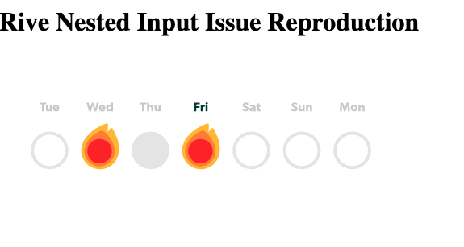

# Rive Nested Input Bug Reproduction

This repository demonstrates a potential race condition with Rive's nested inputs when initializing state under slower network conditions.

## The Issue

When initializing multiple nested inputs (`revealed` and `type`) on streak elements in a Rive animation:

1. Under normal conditions:

   - Streaks with `revealed: false, type: 0` appear as empty outlined circles
   - Streaks with `revealed: true, type: 1` appear as filled grey circles
   - The `reveal` animation correctly animates the filled circles with fire

2. Under slower network conditions (Fast 4G or slower):
   - Streaks that should be `revealed: false, type: 0` incorrectly appear as `revealed: true, type: 0`
   - This suggests the initial state setting is racing with the Rive runtime initialization

## Steps to Reproduce

1. Clone this repository
2. Install dependencies:

   ```bash
   pnpm install
   ```

3. Start the development server:

   ```bash
   pnpm dev
   ```

4. Open Chrome DevTools
5. Set network throttling to "Fast 4G" or slower
6. Observe that streaks initialized with `revealed: false` appear as `revealed: true`

## Technical Details

The reproduction uses:

- React 18.3.1
- @rive-app/react-canvas ^4.17.5
- TypeScript
- Vite

The key code setting the states:

```
typescript
const initialize = (rive: Rive) => {
// Should appear as empty outlined circle
rive.setBooleanStateAtPath("revealed", false, "streak-0");
rive.setNumberStateAtPath("type", 0, "streak-0");
// Should appear as filled grey circle
rive.setBooleanStateAtPath("revealed", true, "streak-2");
rive.setNumberStateAtPath("type", 1, "streak-2");
};
```

## Expected Behavior

- Streaks initialized with `revealed: false, type: 0` should consistently appear as empty outlined circles
- State initialization should be reliable regardless of network conditions

## Actual Behavior

- Under slower network conditions, streaks initialized with `revealed: false` appear as if `revealed: true`
- Despite having a "ready" event handler, the state initialization happens in a separate effect when the `rive` object becomes available
- This suggests the `rive` object might be available before the runtime is fully initialized

## Possible Solutions to Investigate

1. Move the state initialization into the "ready" event handler instead of a separate effect
2. Add a delay before state initialization
3. Implement retry logic for state initialization
4. Consider moving initial states to the Rive file itself

## Environment Details

- Browser: Chrome (latest)
- Network: Issue reproduces on Fast 4G or slower
- React: 18.3.1
- Rive React Canvas: ^4.17.5

Without Throttling:


With Throttling:

