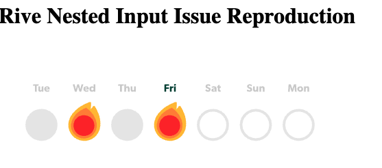

# Rive Nested Input Bug Reproduction

This repository demonstrates an initialization race condition with Rive's nested inputs when the default state differs from the programmatically set state.

## The Issue

When initializing multiple nested inputs (`revealed` and `type`) on streak elements in a Rive animation:

1. Under normal conditions:

   - Streaks with `revealed: false, type: 0` appear as empty outlined circles
   - Streaks with `revealed: true, type: 1` appear as filled grey circles
   - The `reveal` animation correctly animates the filled circles with fire

2. Under slower network conditions (Fast 4G or slower):
   - Streaks that should be `revealed: false, type: 0` incorrectly appear as `revealed: true, type: 0`
   - This occurs because the default state (`revealed: true`) is racing with our programmatic state setting (`revealed: false`)

## Root Cause

The issue was caused by a race condition between:

1. The state machine's default initialization of the `revealed` state to `true`
2. Our programmatic attempt to set `revealed` to `false`

Under slower network conditions, the race condition becomes more apparent as the timing between state machine initialization and our state updates becomes less predictable.

## Solution

Setting the default state of `revealed` to `false` in the Rive editor resolves the issue. This ensures that both:

1. The initial state matches our intended state
2. There's no race condition between default initialization and programmatic updates

## Implications for Rive Users

This suggests a best practice for Rive animations with programmatically controlled states:

1. Default states in the Rive file should match the initial states you plan to set programmatically
2. When states appear to be racing, check the default values in the Rive editor
3. Consider documenting default states as part of the animation's API

## Steps to Reproduce

1. Clone this repository
2. Install dependencies:

   ```bash
   pnpm install
   ```

3. Start the development server:

   ```bash
   pnpm dev
   ```

4. Open Chrome DevTools
5. Set network throttling to "Fast 4G" or slower
6. Observe that streaks initialized with `revealed: false` appear as `revealed: true`

## Technical Details

The reproduction uses:

- React 18.3.1
- @rive-app/react-canvas ^4.17.5
- TypeScript
- Vite

The key code setting the states:

```
typescript
const initialize = (rive: Rive) => {
// Should appear as empty outlined circle
rive.setBooleanStateAtPath("revealed", false, "streak-0");
rive.setNumberStateAtPath("type", 0, "streak-0");
// Should appear as filled grey circle
rive.setBooleanStateAtPath("revealed", true, "streak-2");
rive.setNumberStateAtPath("type", 1, "streak-2");
};
```

## Expected Behavior

- Streaks initialized with `revealed: false, type: 0` should consistently appear as empty outlined circles
- State initialization should be reliable regardless of network conditions

## Actual Behavior

- Under slower network conditions, streaks initialized with `revealed: false` appear as if `revealed: true`
- Despite having a "ready" event handler, the state initialization happens in a separate effect when the `rive` object becomes available
- This suggests the `rive` object might be available before the runtime is fully initialized
- The issue might be related to how the state machine handles nested input initialization:
  - Default states might be set after our initialization
  - There could be implicit dependencies between `revealed` and `type` states
  - The "ready" event might fire before nested inputs are fully initialized

## Possible Solutions to Investigate

1. Move the state initialization into the "ready" event handler instead of a separate effect
2. Add a delay before state initialization
3. Implement retry logic for state initialization
4. Consider moving initial states to the Rive file itself
5. Investigate in Rive Editor:
   - Check default values of nested inputs in State Machine Inspector
   - Examine state machine initialization order
   - Look for implicit state dependencies
   - Consider adding state machine breakpoints to debug initialization sequence

## Environment Details

- Browser: Chrome (latest)
- Network: Issue reproduces on Fast 4G or slower
- React: 18.3.1
- Rive React Canvas: ^4.17.5

## Visual Demonstration

### Without Network Throttling

Expected behavior - empty circles remain empty:


### With Network Throttling (Fast 4G)

Bug reproduction - empty circles appear filled:

